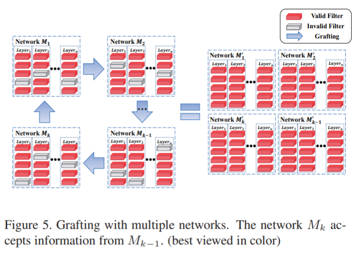

# 介绍

与之前所看到的一些关于 filter pruning 的文章不同，作者认为那些通过 filter pruning 方法剪去的滤波器在某些特定场景可能还是有用的，作者提到像集成学习中一样，单个分类器的效果并不理想，但多个分类器组合在一起效果就有很大提升。所以在这篇文章中，作者不考虑将这些不重要的滤波器剪去，而是为它们重新赋值，尝试重新激活它们。也就是作者所提出的嫁接方法，将其他的数据嫁接到这些不重要的 filter 上。

# 三种嫁接策略
作者提出了三种嫁接策略：
1. 采用高斯噪声作为数据嫁接到不重要的 filter 上
2. 采用自身其他的 filter 作为数据嫁接到不重要的 filter 上
	- 将 filters 按计算得到的重要性进行排序
	- 小于设定阈值的 filter 被认为是不重要的
	- 将最重要的 filter 数据嫁接到最不重要的 filter 上，将第二.....，以此类推
	- ==但是这种数据并没有为网络带来新的数据，导致效果不佳==
	
3. 采用外部网络的 filter 作为嫁接对象
	- 将两（多）个网络并行训练，并进行 filter 的重要性计算
	- 将另一个网络的 filter 嫁接到该网络的 filter 上
	- ==采用将整层的 filters 全部嫁接的方式，而不是单个 filter 嫁接的方式==
	- 通过一个自调节系数 α 来控制不同网络的 filter 数据所占的比重
	- 如下所示，$W_i^{M_2}$ 即表示 $M_2$ 网络的第 $i$ 层的权重
	$$W_i^{M_2'}=\alpha W_i^{M_2}+(1-\alpha)W_i^{M_1} \quad (0<\alpha<1) \tag{1}$$
	（论文中式 2）
	

由于第三种方法的效果比较好，所以作者接下来采用的都是第三种方法，由此作者引出了两个问题
1. 如何计算权重 $W_i^{M_1}$ 和 $W_i^{M_2}$
2. 如何计算比例系数 α

# 如何计算权重
对于如何计算权重，作者同样给出了两种标准
1. 根据 $L_1$ 范数
2. 根据熵

>知道的信息越多，熵越小；知道的信息越少，熵越大。也就是变量的不确定性越大，熵就越大。而取负值，是因为小概率的事件信息量更大，大概率事件的信息量更小。
![[Pasted image 20211119203943.png]]

在这里，作者将 filter 中的数值排序后，按序分为了 m 堆，然后计算每个堆各自的概率，最后该 filter 的熵即为 
$$H(W_{i,j})=-\sum_{k=1}^B p_k log p_k \tag{2}$$
（论文中式 4）

这里的 $B$ 就是堆的个数，$p_k$ 就是第 $k$ 个堆的概率，$H(W_{i,j})$ 的值越小，说明这个 filter 值的分布变化越少，即 filter 中的数值差距不大

一个层中共有 $C$ 个 filter，所以整个层的信息就是 $$H(W_i)=\sum_{j=1}^C H_{i,j} \tag{3}$$
（论文中式 5）

但是式子（3）没有考虑到 filter 之间的关系，而是单独计算每个 filter 的熵，为了保持层的连续性，作者这里直接计算整个层的权重
$$H(W_i) = -\sum_{k=1}^B p_k log p_k \tag{4}$$
（论文中式 6）

似乎和（2）式没有什么区别，但这里的堆中的数据不是单个 filter 中的数据分布，而是整个层中所有 filter 中的数据的分布。

# 如何计算比例系数 α
关于比例系数 α，作者提出了两个条件
1. 当 $H(W_i^{M_2})=H(W_i^{M_1})$ 时，α 应该等于 0.5，即两个网络所含的信息量相等，即各取一半，当 $H(W_i^{M_2})>H(W_i^{M_1})$ 时，α 应该大于 0.5，即 $M_2$ 网络所含的信息量更大，所以占更大比例（本文式 1）
2. 每个网络都应该发挥一部分作用，所以 α 一定大于 0，哪怕 $H(W_i^{M_2})\gg H(W_i^{M_1})$ 或者 $H(W_i^{M_2}) \ll H(W_i^{M_1})$

鉴于上述条件，最终作者得到的 α 的计算公式如下
$$\alpha = A * (arctan(c*(H(W_i^{M_2})-H(W_i^{M_1}))))+0.5 \tag{5}$$
（论文中式 7）

# 实验
作者进行了多个对比实验
1. 比较采用不同嫁接信息来源的情况
2. 比较采用 $L_1$ 范数和熵的情况
3. 比较用于嫁接的两个网络之间是相似好还是差异大好
4. 和其他网络的比较

最终得到的结果是采用外部数据，使用熵来计算信息量，用于嫁接的网络差异大，最终得到的结果会更好

# 多个网络并行训练
在多个网络训练中，每个网络从前一个网络来获取嫁接的数据

>剪枝将不重要的滤波器剪去，从而在精确性变化不大的前提下，实现计算量的降低，从而加快计算速度
嫁接不剪去不重要的滤波器，而是为其注入新的数据，从而提高精确性
两者是不是没有大的相关，都是从 filter 的角度出发，但一个是降低计算量，加速计算，另一个是提高精确性

