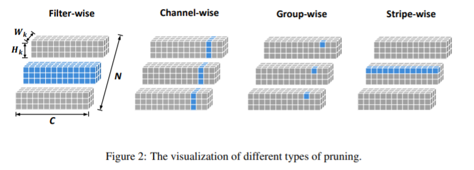
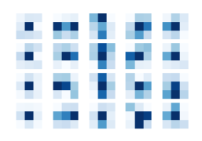
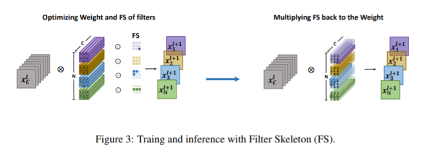

# 介绍
现在主流的剪枝操作可以分为权重剪枝和滤波器剪枝两个类别，其中滤波器剪枝的一个标准流程是：
1. 训练一个大网络直至收敛
2. 根据一定的规则剪去一部分滤波器
3. 对剪枝后的网络进行微调

这些方法多数只是对网络的结构进行调整，而作者认为，不只是网络的结构有影响，滤波器本身的结构也很重要。Christian Szegedy[^ChristianSzegedy] 等人也提出了类似的想法。他们是手动设定了不同的 kernel size，但手动设置需要一定的专业知识和实验经验，且需要对网络进行特定的设计。因此作者想着，能不能通过对滤波器结构进行剪枝来自动选择出最优的卷积核尺寸。

作者提出了逐条剪枝的方法，一个滤波器的大小可以描述为 $N*C*K*K$，其中 $N$ 和滤波器个数，$C$ 为滤波器（层）的通道数，$K*K$ 为滤波器的卷积核尺寸，而条的概念则是将 $C$ 去除，将同一位置，不同 $C$ 的点视为一个整体，即一个 $C*K*K$ 的滤波器，可以分为 $K^2$ 个 $1\times 1$ 的长条，即一个 Stripe.

通过对滤波器中每个 Stripe 的研究，计算每个 Stripe 的 $l_1 norm$，得到了下图的结果。可以发现，每个滤波器中，每条 Stripe 所做出的贡献也是不同的，颜色深的 Stripe 所做出的贡献更大，而颜色深的则相对来说更加”不重要“，可以剪去。

和其他滤波器剪枝方法的比较，如图一所示。Filter-Wise 和 Channel-Wise 方式剪枝的层面太大，可能会损失一些内容，而且无法进行更细的剪枝。而 Group-Wise 方法虽然也有更好的细粒度，但是它忽略了滤波器之间的独立性，即不同滤波器中的无效值的位置可能是不同的，通过 Group-Wise 方法剪枝，可能会剪去一部分有效值。

# 提出的方法
## 1. 滤波器骨架-Filter Skeleton（FS）
滤波器骨架是一个描述滤波器形状的矩阵，即在这 $K*K$ 个 Stripe 中，该 Filter 中哪几个 Stripe 是有效的，如下图所示。

每个 FS 一开始都是一个全一矩阵，在训练时，将 FS 与滤波器权重相乘，即 1 的位置留下，0 的位置去除。其损失函数表示为
$$L = \sum_{(x,y)}loss(f(x,W\odot I),y) \tag{1}$$
其中 $I$ 代表 FS，$\odot$ 代表点乘，接下来是将 FS 与滤波器权重相乘，即
$$X^{l+1}_{n,h,w} = \sum^C_c\sum^K_i\sum^K_j I^l_{n,i,j}\times W^l_{m,c,i,j}\times X^l_{n,h+i-\frac{K+1}{2},w+j-\frac{k+1}{2}} \tag{2}$$
(2) 式即带 FS 的卷积操作，在（1）式中，滤波器权重和 FS 一起进行优化，并且在训练之后，将 $I$ 合并到了权重之中，（ $W\odot I \to W$ )在接下来的评估过程中，只使用权重，借此，没有为网络添加额外的运算量。

## 根据 FS 进行的逐条剪枝
为了获得一个剪枝程度更高的网络，我们需要让 FS 矩阵变得尽量稀疏，因此在损失函数中加入一个 FS 的正则项。
$$L = \sum_{(x,y)}loss(f(x,W\odot I),y)+\alpha g(I) \tag{3}$$
其中α是控制正则项重要性的系数，$g(I)$ 则是 $I$ 的 $l_1$ 范数的惩罚值，其中 $g(I)$ 可以表示为，因为 $l_1norm$ 就是权重的绝对值之和
$$g(I) = \sum^L_{l=1}g(I^l)=\sum^L_{l=1}(\sum^N_{n=1}\sum^K_{i=1}\sum^K_{j=1}|I^l_{n,i,j}|) \tag{4}$$
接下来，作者设置了一个阈值 $\delta$，小于这个阈值的 Stripe 都被视为不重要的，所以可以删去。==另外值得注意的一点是，经过剪枝后的滤波器已经不再完整，所以我们不能直接用一整个滤波器去进行卷积运算，而是用每个单独 Stripe 去进行卷积运算，再将得到的结果相加。== 如下图所示

用数学公式可以这么表示
$$\begin{equation} \begin{split} X^{l+1}_{n,h,w}&=\sum^C_c\sum^K_i\sum^K_jW^l_{n,c,i,j}\times X^l_{n,h-i+\frac{K+1}{2},w-j+\frac{K+1}{2}}\qquad standard\ \ convolution \\
&=\sum^K_i\sum^K_j(\sum^C_cW^l_{n,c,i,j}\times X^l_{n,h-i+\frac{K+1}{2},w-j+\frac{K+1}{2}}) \quad stripe \ \ wise \ \ convolution
\end{split}
\end{equation}
\tag{5}
$$
在式子中可以看到，和正常的卷积操作相比，这里只是变换了一下计算顺序。
原本先计算一个卷积核的卷积结果，即 $1\times K\times K$ 的卷积核计算得到的”面“，再将每层卷积核得到的“面”进行叠加，即 $C$ 个 $1\times K\times K$ 的卷积核得到的面相加。
这里先则计算一“条”的卷积结果，即 $C\times 1 \times 1$ 的卷积核计算得到的面，再将每”条“放在一起，即 $K\times K$ 个 $C \times 1 \times 1$ 的卷积核得到的面相加，即如上图所示，不过这里不是 $K^2$ 个 Stripe，而是额外保存的有效的 Stripe 的索引位置。
==在实验中作者还发现，在靠近输入的卷积层中，滤波器一般有较多的 Stripe 是有效的，而在中间层中，大多数的 Filter 都只有少量有效的 Stripe，说明冗余很可能出现在中间的几层==

[^ChristianSzegedy]: 
Going Deeper With Convolutions, CVPR June 2015
Rethinking The Inception Architecture for Computer Vision, CVPR 2016